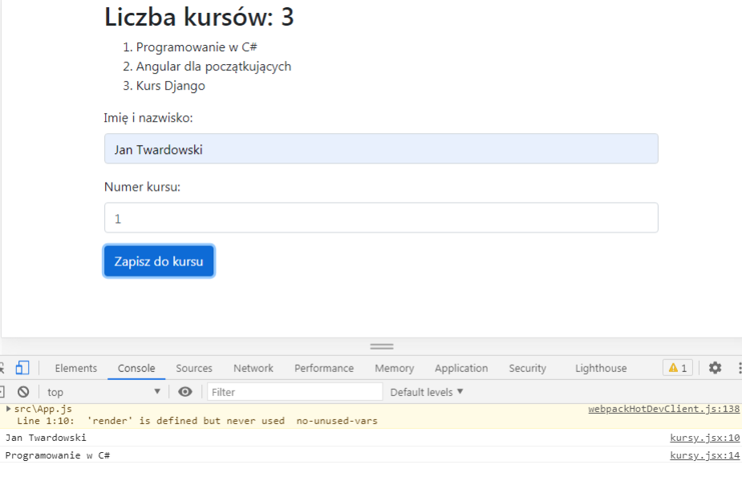

# EGZAMIN ZAWODOWY — INF.04 (INF.04-02-22.06-SG)

## Informacje ogólne

- **Część praktyczna** — Rok 2022
- **Czas trwania egzaminu:** 180 minut
- **Nazwa kwalifikacji:** Projektowanie, programowanie i testowanie aplikacji
- **Oznaczenie kwalifikacji:** INF.04
- **Numer zadania:** 02
- **Wersja arkusza:** SG
- **Podstawa programowa:** 2019
- **Układ graficzny:** © CKE 2020

---

## Część II. Aplikacja Web

Wykonaj aplikację internetową typu front-end obsługującą zapisy na kursy z zastosowaniem dostępnego na stanowisku egzaminacyjnym frameworka **Angular** lub biblioteki **React**.
Zastosuj bibliotekę **Bootstrap** do zdefiniowania stylu formularza.

---

### Obrazy referencyjne

**Obraz 1b. Aplikacja React.js**

Na obrazach 1a i 1b przedstawiono działanie aplikacji przygotowanej w środowisku Angular i React.js, stan po wybraniu przycisku „Zapisz do kursu”.
W konsoli widoczne jest wyświetlenie imienia i nazwiska oraz nazwy kursu na podstawie danych wprowadzonych do formularza.

---

### Założenia aplikacji

- Aplikacja składa się z **jednego komponentu**.
- Danymi komponentu jest **tablica z nazwami kursów**: "Programowanie w C#", "Angular dla początkujących", "Kurs Django"

Dla uproszczenia tablica może być zdefiniowana jako pole komponentu.Należy założyć, że tablica w przyszłości może się zmienić, co będzie miało wpływ na zachowanie i wygląd aplikacji.

- Komponent wyświetla:
- **Nagłówek drugiego stopnia (H2)** o treści:`Liczba kursów: <liczba>`gdzie `<liczba>` oznacza wielkość tablicy z nazwami kursów.
- **Listę numerowaną**, generowaną automatycznie dla wszystkich elementów tablicy, niezależnie od jej wymiaru.
- **Formularz**, składający się z:

  - pola edycyjnego tekstowego i etykiety „Imię i nazwisko:”
  - pola edycyjnego numerycznego i etykiety „Numer kursu:”
  - przycisku „Zapisz do kursu”
- Aplikacja w stanie początkowym wyświetla **puste pola formularza**.
- Elementy formularza są formatowane zgodnie z obrazem 1a lub 1b przy użyciu stylów biblioteki **Bootstrap**.
  Do budowy szablonu HTML należy wykorzystać pomoc zamieszczoną w **Tabeli 1**.
  Należy zastosować znaczące nazwy dla identyfikatorów pól formularza.

---

### Obsługa formularza

Po wybraniu przycisku formularza jest generowane zdarzenie zatwierdzenia, które wyświetla w konsoli przeglądarki:

- wartość wpisaną w pierwszym polu formularza,
- nazwę kursu odpowiadającą numerowi wpisanemu w drugie pole formularza,
- jeżeli kurs o takim numerze istnieje – wyświetlona jest jego nazwa,
- w przeciwnym wypadku – komunikat **„Nieprawidłowy numer kursu”**.

---

### Wymagania jakościowe

- Program powinien być zapisany **czytelnie**, z zachowaniem zasad czystego formatowania kodu.
- Należy stosować **znaczące nazwy zmiennych i funkcji**.
- Dokumentacja do programu powinna być wykonana zgodnie z wytycznymi z **części III** zadania egzaminacyjnego.

---

### Organizacja projektu

Kod aplikacji należy przygotować do nagrania na płytę.W podfolderze `web` powinno znaleźć się:

- archiwum całego projektu `web.zip`,
- pliki z kodem źródłowym, które były modyfikowane.
